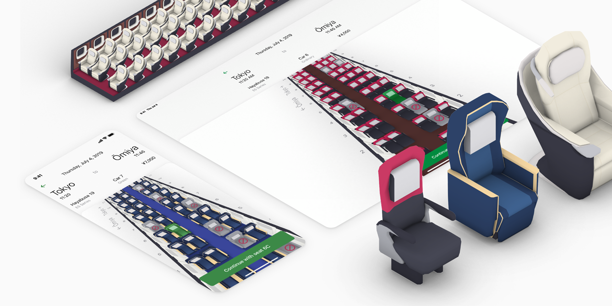
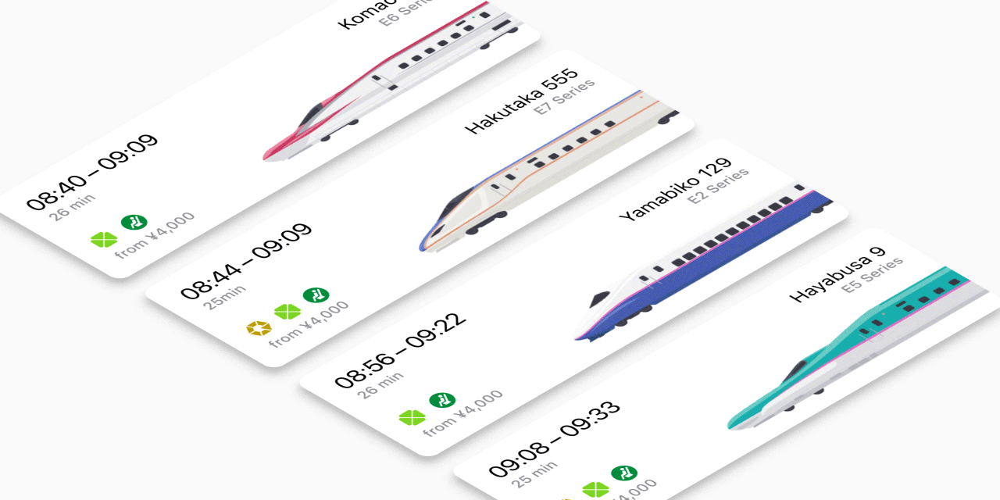
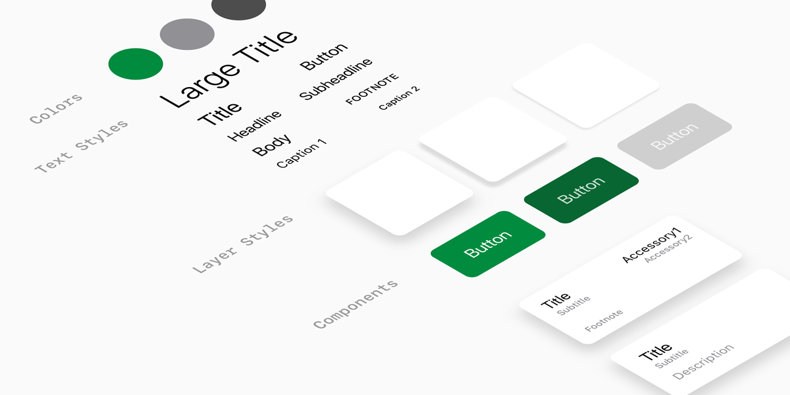

# Shinkansen 3D Seat Booking Prototype

Shinkansen 3D seat booking prototype is an example app in iOS utilizing [SceneKit](https://developer.apple.com/documentation/scenekit), an Apple high-level 3D rendering engine, to show the possibility of integrating 3D technology to visualize actual spaces which in this case is a Japanese high-speed train's seat map ([Shinkansen](https://en.wikipedia.org/wiki/Shinkansen)).

Besides the 3D seat map, this example app also includes some several interesting aspects including an example of [Atomic Design](http://atomicdesign.bradfrost.com/) methodology workflow that has been implemented in the codebase and smooth view transition that turns navigational push animation into seamless step by step flow.

## Table of Contents

* [Notable Features](#notable-features)
  * [3D Seat Map](#3d-seat-map)
  * [Seamless View Transition](#seamless-view-transition)
  * [Atomic Design System](#atomic-design-system)
  * [Design and 3D Assets](#design-and-3d-assets)
* [Demo](#demo)
* [Compatibility](#compatibility)
* [Developing Requirements](#developing-requirements)
* [Build Process](#build-process)
* [External libraries](#external-libraries)
  * [Kumi-iOS](#kumi-ios)
  * [BrightFutures](#brightfutures)
* [Next Steps](#next-steps)
* [Fun Facts](#fun-facts)
  * [What is SceneKit?](#what-is-scenekit)
  * [What is Atomic Design System?](#what-is-atomic-design-system)
* [Contributing](#contributing)
* [License](#license)

## Notable Features

### 3D Seat Map

When talking about 3D in mobile apps, many people are thinking about 3D games right away, but this feature in this prototype is ultimately going to change that notion. The feature includes the real-time 3D rendering of the high-speed train cabin which allows users to understand the look of the real space and more easily make a decision on what and where the seat they want to pick.

In this feature, SceneKit, which is one of the iOS-native framework made by Apple, has been used as a 3D framework, and it allows the other parts of the app to remain to have a native behavior.

### Seamless View Transition

View transition animation is a set of animations that occurs when the app suggests bringing from one view to the other. Custom built view transition animations are used in all the in-between views to communicate and navigate users in a meaningful and seamless way.

### Atomic Design System

This prototype's atomic design system has been influenced by Brad Frost Atomic Design article, which is a methodology to organize design elements into categorized groups. As the design implementation of the prototype has been broken down into hierarchical components, It allows the app to be structured orderly and very easy to edit and expand.

### ~~Design and 3D Assets~~

~~Besides features that are in the prototype app, all design files and 3D assets in this repository are here and open-sourced under the MIT license, so feel free to experiment and play around with those assets!~~ (Coming Soon)

## Articles

Here are some complimentary articles to learn more about this prototype.
* [3D doesn't always mean games or AR: 3D Seat Map](https://medium.com/dansiam/3d-seat-map-17ecf34f8f47)
* [The Make of 3D Seat Map: Engineering Episode](https://medium.com/dansiam/the-make-of-3d-seat-map-engineering-episode-494846b5f75e)
* ~~The Make of 3D Seat Map: Design Episode~~ (Coming Soon)

## Demo
You can install this Shinkansen 3D seat booking prototype app on-the-fly via [Testflight](https://apps.apple.com/us/app/testflight/id899247664) by using [this link](https://testflight.apple.com/join/lABxMaaE).

## Compatibility 

* iOS 11.0+

## Developing Requirements

* Xcode 10.2+
* iOS 11.0
* Swift 5+

## Build Process

By following the steps, you should already have [Xcode 10.2+](https://apps.apple.com/us/app/xcode/id497799835) and [CocoaPods](https://guides.cocoapods.org/using/getting-started.html) installed, and of course, a Mac is required if you wish to develop for iOS.

1. You have options to either directly download the repository or clone the repository via Git method.
2. After you have the project stored locally in your machine, install framework dependencies by running pod install command in Terminal under the repository directory.
3. After that, then open Shinkansen 3D Seat Booking Prototype.xcworkspace file.
4. So now you can run the project either in the simulator or physical devices (you need to have change Apple Developer Certificate to be yours before have it run on the devices)
5. Enjoy, be creative, and maybe contribute to the project!

## External libraries

This project mostly uses standard iOS frameworks. Regardless, a few external libraries are used in this project, and here are those libraries.

### Kumi-iOS

Kumi-iOS is an iOS framework that abstracts common design values into different designer-understandable data objects such as `TextStyle`, `LayerStyle`, `AnimationStyle`, and it also comes with convenience extensions for setting those values into different subclasses of `UIView`.

In this project, Kumi-iOS is used for all design elements and is as a part of Atomic Design System methodology.

[Kumi-iOS Repository](https://github.com/prolificinteractive/Kumi-iOS)

### BrightFutures

BrightFutures is a Swift framework that handles asynchronous code with a handful of completion blocks and type-safe error handling.

In this prototype, BrightFutures plays a vital role to handle and organize the loading method of multiple 3D assets asynchronously.

[BrightFutures Repository](https://github.com/Thomvis/BrightFutures)

## Next Steps

* [ ] Preparing Design and 3D Assets
* [ ] Wrapping up 'The Make of 3D Seat Map: Design Episode' article
* [ ] Improvement of Cloning Material
* [ ] Framework Development

## Fun Facts

### What is SceneKit?

SceneKit is a high-level 3D graphics API made by Apple to provide an easy-to-use layer over the lower level APIs (Metal.) SceneKit's main features include object-based scene graph, physics engine, and particle system.

In this prototype, SceneKit has been used as the main framework to render 3D visualization of the seat map. As `SCNView` that is used to display the seat map is a subclass of `UIView`, it behaves like any other subclasses of `UIView`, so that makes the whole prototype remains to have native look and feel.

[Read more about SceneKit](https://developer.apple.com/documentation/scenekit)

### What is Atomic Design System?

Atomic Design is a methodology coined by Brad Frost. It is a method of creating and maintaining design system in a systematic hierarchy and useful pattern. It consists of collections of reusable components that have been organized and standardized, and they can easily be assembled to be an application.

This prototype showcase the use of this method in the *Design System* folder.

[Read more about Atomic Design](http://atomicdesign.bradfrost.com/table-of-contents/)

## Contributing

Don't hesitate to contribute to this project! I know there is much room for improvement, so feel free to provide ideas or open pull requests with new features or solve existing issues with your way. 😉

## Note

First off, I'd like to say thank you to all of you who visits this repository. Each of you might have different reasons for visiting here, but I hope that the project is useful for you at some level. 🙂

Also, I'd like to give a big thanks to [Nattawut S.](https://github.com/indevizible) as a partner who has been contributing a lot and makes this project happen. 🙏

One reason this repository exists is to share knowledge to the community, but at the same time, I believe that what it is here is not perfect and there is a room for improvement, so if you want to share ideas or what you know, please do so. I'm also ready to learn more! 👍

## License

Shinkansen 3D Seat Booking Prototype for iOS is released under the MIT license. [See LICENSE](https://github.com/virakri/shinkansen-tickets-booking-prototype/blob/master/LICENSE) for details.
